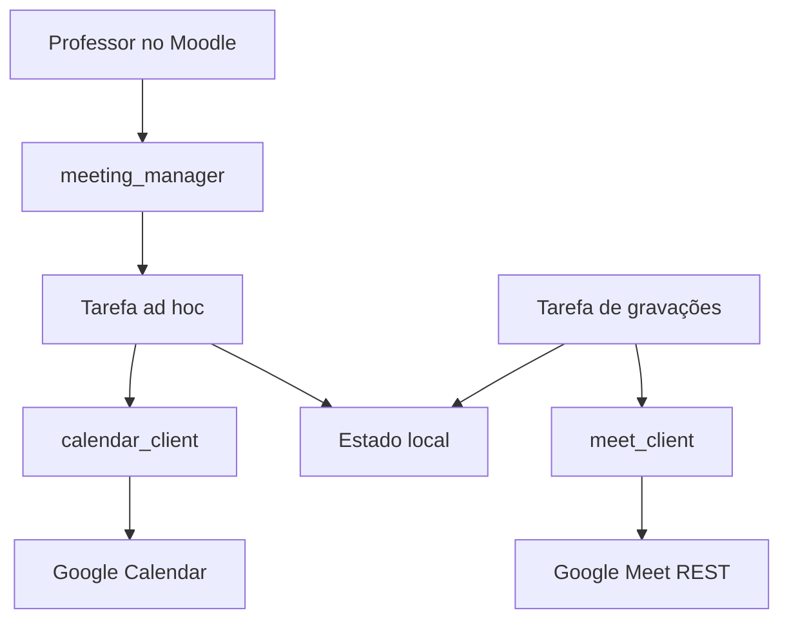
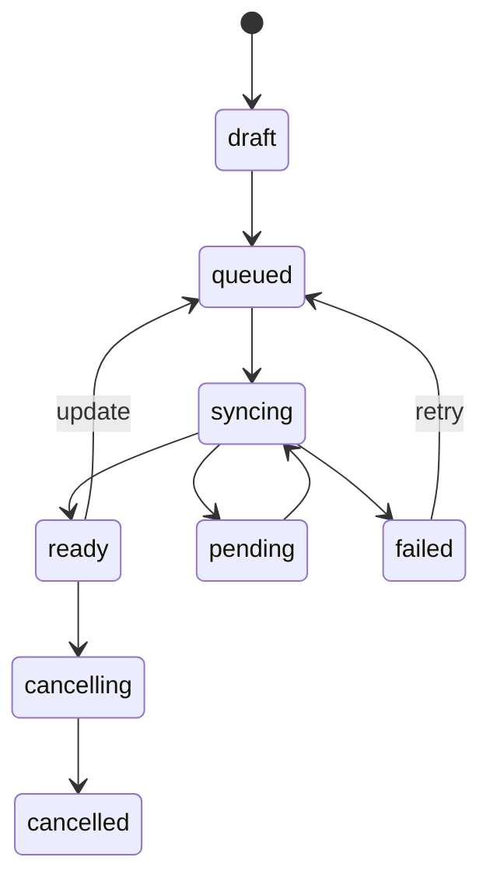

# Auditoria técnica e plano de modernização

**Projeto:** `mod_googlemeet`  
**Base auditada:** `ronefel/moodle-mod_googlemeet`  
**Commit de referência:** `80a50eac88522c6093a493085b617b0e3b7071d5`  
**Versão de referência:** `2.1.1` (`2023050101`)  
**Data da auditoria:** 26 de julho de 2026  
**Alvo aprovado:** Moodle 5.2; PHP 8.3 e 8.4  
**Próxima linha de desenvolvimento:** `3.0.0-dev`

## 1. Resumo executivo

O plugin pode e deve ser modernizado por meio de um fork que mantenha o componente
`mod_googlemeet`, a licença GPL e o histórico do projeto original. A base é pequena:
66 commits, 31 arquivos PHP e aproximadamente 5.845 linhas no repositório completo,
incluindo licença, traduções, CSS, templates e JavaScript minificado.

O reaproveitamento é viável, mas a versão 2.1.1 não deve ser declarada compatível com
Moodle 5.2 sem uma modernização substancial. A auditoria encontrou:

- uma alteração automática de permissões que pode tornar gravações acessíveis a
  qualquer pessoa com o link;
- funções externas que não comprovam que o objeto alterado pertence à atividade cujo
  contexto foi autorizado;
- ausência de atualização e exclusão dos eventos correspondentes no Google Calendar;
- ausência de idempotência e de acompanhamento da criação assíncrona da conferência;
- armazenamento de um identificador derivado do link do Calendar no campo que deveria
  guardar o ID da API;
- falhas funcionais no OAuth, nas notificações, na privacidade, no backup e na
  restauração;
- APIs externas e padrões de JavaScript pertencentes à arquitetura antiga do Moodle;
- inexistência de testes automatizados e de integração com a visão geral de atividades
  do Moodle 5.2.

A recomendação é preservar as regras de negócio úteis e o caminho de atualização dos
dados, mas substituir a camada Google, o ciclo de sincronização e a fronteira de
segurança.

### Decisão de viabilidade

**Prosseguir com o fork.** A estimativa inicial é:

| Categoria | Estimativa |
|---|---:|
| Conceitos funcionais preserváveis | 60%–70% |
| Código reutilizável com adaptação | 35%–45% |
| Código preservável praticamente sem alteração | 20%–30% |
| Código que deve ser refeito | 55%–65% |

Essas faixas não representam esforço linear. A integração com o Google concentra
menos linhas que a interface, mas responde pela maior parte do risco e dos testes.

## 2. Escopo e método

Foram examinados:

- histórico, tags, estrutura e licença;
- ciclo de criação, edição e exclusão da atividade;
- Calendar API, Drive API, OAuth e descoberta de gravações;
- tabelas, índices, upgrades e sincronização;
- capabilities, funções AJAX e validação de contexto;
- tarefas, notificações e eventos do calendário do Moodle;
- privacidade, backup e restauração;
- formulários, Mustache, JavaScript, Moodle App e Boost;
- requisitos e APIs oficiais do Moodle 5.2;
- Calendar API v3, Meet REST API v2, Drive API v3 e OAuth 2.0 atuais.

A sintaxe dos 31 arquivos PHP foi analisada com `php-parser` 3.2.5, sem falhas
sintáticas. O ambiente de auditoria não possui o executável PHP; por isso, lint nativo,
PHPUnit, Behat, Moodle Code Checker e instalação real no Moodle ainda não foram
executados. Esses testes fazem parte do próximo estágio.

## 3. Baseline e procedência

| Item | Estado |
|---|---|
| Upstream | `ronefel/moodle-mod_googlemeet` |
| Fork | `andersrodigrue/moodle-mod_googlemeet` |
| Branch padrão | `master` |
| Commit comum na criação do fork | `80a50eac88522c6093a493085b617b0e3b7071d5` |
| Commits no upstream | 66 |
| Autoria observada | Rone Santos / `ronefel` |
| Licença | GNU GPL v3 ou posterior |
| Última versão marcada | `v2.1.1` |
| Requisito declarado | Moodle 3.7 |
| PHP declarado no README | PHP 7.0+ |
| Testes automatizados | inexistentes |
| CI | inexistente |

O fork deve manter:

- os avisos de copyright nos arquivos herdados;
- a licença GPL;
- a referência ao projeto original no README;
- o upstream configurado separadamente do repositório de desenvolvimento;
- um changelog que distinga claramente código herdado e modernização.

## 4. Inventário do código atual

### 4.1 Componentes principais

| Área | Arquivos atuais | Diagnóstico |
|---|---|---|
| Ciclo do módulo | `lib.php`, `locallib.php`, `mod_form.php` | Regras úteis misturadas com persistência, UI e integrações externas |
| Google/OAuth | `classes/client.php`, `classes/rest.php`, `classes/helper.php`, `callback.php` | Cliente monolítico, operações síncronas e tratamento de erro limitado |
| Serviços externos | `classes/external.php`, `db/services.php` | Estrutura anterior ao Moodle 4.2 e validação de objeto/contexto incompleta |
| Dados | `db/install.xml`, `db/upgrade.php` | Modelo insuficiente para sincronização confiável |
| Tarefas | `classes/task/notify_event.php`, `db/tasks.php` | Apenas lembrete; não há tarefas para Google ou reconciliação |
| Calendário Moodle | `classes/helper.php`, `googlemeet_events` | Ocorrências expandidas localmente, com riscos de fuso e horário de verão |
| Gravações | `googlemeet_recordings`, Mustache e JS | Descoberta frágil e permissão externa insegura |
| Privacidade | `classes/privacy/provider.php` | Parcial, com erro funcional e sem declarar destinos Google |
| Backup/restore | `backup/moodle2/*` | Preserva links externos e gravações sem política segura de reconexão |
| Interface web | `view.php`, templates, `styles.css` | Funcional, porém acoplada, com JavaScript inline e problemas de acessibilidade |
| Moodle App | `db/mobile.php`, `classes/output/mobile.php`, dois templates | Mantém variante Ionic 3 e lógica duplicada |
| Traduções | `lang/en`, `lang/pt_br` | Boa base bilíngue; precisa de novas strings e revisão terminológica |

### 4.2 Fluxo atual de criação

1. O formulário instancia `mod_googlemeet\client`.
2. O professor concede Calendar e Drive em uma única autorização.
3. O plugin insere um evento no calendário principal.
4. Em uma segunda requisição, faz `PATCH` para solicitar a conferência.
5. A resposta imediata é tratada como concluída.
6. O link do Meet é salvo.
7. O parâmetro `eid` do `htmlLink` é salvo em `eventid`.
8. Ocorrências são calculadas e gravadas localmente.

Esse fluxo não possui transação distribuída, compensação, estado intermediário ou
reconciliação. Uma falha após o passo 3 pode deixar um evento órfão no Google; uma
repetição pode criar outro evento.

## 5. Achados priorizados

### F-001 — Gravações tornadas públicas automaticamente

**Severidade: crítica**  
**Área:** segurança, privacidade e Google Drive

Ao sincronizar uma gravação, o plugin envia uma criação de permissão com:

```json
{
  "role": "reader",
  "type": "anyone"
}
```

Isso pode transformar o arquivo em acessível a qualquer pessoa que obtenha o link. A
mudança acontece como efeito colateral da descoberta da gravação e não exige uma opção
específica ou confirmação do professor.

**Evidência:** `classes/client.php`, linhas 360–371.

**Correção obrigatória:**

- remover a criação automática de permissões;
- no fluxo padrão, nunca alterar ACLs do Drive;
- separar “descobrir gravação” de “compartilhar gravação”;
- se compartilhamento for implementado no futuro, exigir decisão explícita, mostrar
  destinatários e efeitos, registrar auditoria e oferecer reversão;
- não usar “qualquer pessoa com o link” como padrão.

### F-002 — Alteração de objetos de outra atividade pelas funções externas

**Severidade: alta**  
**Área:** autorização

As funções recebem simultaneamente `recordingid` ou `googlemeetid` e
`coursemoduleid`. A capability é verificada no contexto do `coursemoduleid`, mas o
registro é obtido apenas pelo outro ID. Não há prova de que a gravação ou atividade
pertence àquele módulo.

Um usuário com permissão de edição em uma atividade pode, em princípio, fornecer o ID
de uma gravação pertencente a outra atividade e alterar seu nome ou visibilidade.
`delete_all_recordings` e o serviço legado de sincronização apresentam a mesma classe
de falha.

**Evidência:** `classes/external.php`, linhas 216–238, 279–305 e 346–366.

**Correção obrigatória:**

- obter a instância a partir do `cmid`;
- executar `validate_context()` no contexto do módulo;
- buscar o objeto por uma condição composta, como `id` + `googlemeetid`;
- rejeitar qualquer divergência;
- criar uma classe externa por ação, no namespace `mod_googlemeet\external`;
- testar explicitamente tentativa de acesso cruzado.

### F-003 — Edição e exclusão não são propagadas ao Google

**Severidade: alta**  
**Área:** integridade e ciclo de vida

`googlemeet_update_instance()` atualiza apenas o Moodle. A mudança de nome, data,
horário ou recorrência não modifica o evento no Google Calendar.

`googlemeet_delete_instance()` exclui os registros locais, mas não exclui nem cancela
o evento no Google.

**Consequências:**

- Moodle e Google exibem horários diferentes;
- alunos podem receber informação divergente;
- eventos órfãos permanecem no calendário do professor;
- uma nova tentativa pode gerar reunião duplicada.

**Correção obrigatória:** introduzir operações idempotentes `create`, `update`,
`cancel/delete` e `reconcile`, executadas por tarefa em nome do proprietário.

### F-004 — Criação assíncrona da conferência é tratada como síncrona

**Severidade: alta**  
**Área:** Calendar API

A Calendar API gera `conferenceData` de maneira assíncrona. A resposta pode estar em
`pending`, sem `hangoutLink` definitivo. O plugin usa a resposta do `PATCH`
imediatamente e não consulta o estado posteriormente.

**Evidência:** `classes/client.php`, linhas 285–303; `lib.php`, linhas 82–88.

**Correção obrigatória:**

- guardar `conferenceData.createRequest.requestId`;
- persistir o estado `pending`, `success` ou `failure`;
- consultar novamente o evento quando estiver pendente;
- usar retentativa com backoff para erros transitórios;
- limitar tentativas e expor erro acionável ao professor;
- nunca interpretar ausência de `hangoutLink` como sucesso.

### F-005 — Identidade externa incorreta e criação não idempotente

**Severidade: alta**  
**Área:** sincronização

O valor salvo em `googlemeet.eventid` é o parâmetro `eid` extraído de `htmlLink`, não
o `id` opaco retornado no recurso da Calendar API. O comentário do banco, entretanto,
o descreve como “Google Calendar Event ID”.

Além disso, a aplicação não fornece um ID próprio na inserção. Em uma perda de
resposta, não consegue distinguir “evento criado” de “evento não criado” e pode
duplicá-lo.

**Correção obrigatória:**

- gerar uma vez um ID válido e imprevisível, por exemplo 128 bits aleatórios
  codificados em hexadecimal;
- persistir esse ID antes de enfileirar a criação;
- usar o mesmo ID em todas as retentativas;
- armazenar separadamente `googleeventid`, `googleeventhtmlurl`,
  `conferenceid`, `meetingcode`, `meetinguri` e `requestid`;
- adicionar `extendedProperties.private` com identificadores não sensíveis do
  plugin/site para reconciliação.

### F-006 — Backup e restauração podem reutilizar recursos externos

**Severidade: alta**  
**Área:** backup, restauração e privacidade

O backup omite `eventid`, mas preserva URL da reunião, e-mail do criador e links das
gravações. Ao restaurar ou duplicar a atividade, o novo curso pode apontar para a mesma
reunião e para os mesmos arquivos externos do curso de origem.

O valor `$userinfo` é obtido, mas não controla a inclusão de gravações.

**Correção obrigatória:**

- nunca restaurar um vínculo ativo com o evento original;
- restaurar a atividade como `disconnected`/`needs_reconnect`;
- limpar IDs externos, Meet URI e gravações por padrão;
- documentar uma opção administrativa explícita para preservar apenas metadados
  permitidos;
- criar testes de duplicação, importação e restauração em outro curso.

### F-007 — Ausência de emissor OAuth pode causar `TypeError`

**Severidade: alta**  
**Área:** PHP 8.3 e OAuth

O construtor marca o cliente como desabilitado quando não encontra o emissor, mas
continua chamando `get_user_oauth_client()`. No Moodle 5.2,
`\core\oauth2\api::get_user_oauth_client()` exige uma instância não nula de
`\core\oauth2\issuer`. PHP 8.3 rejeita `null` antes de qualquer tratamento posterior.

**Evidência:** `classes/client.php`, linhas 60–73 e 82–93.

**Correção obrigatória:** uma conexão desabilitada não pode construir o cliente; as
operações devem retornar um estado tipado ou lançar uma exceção de configuração
traduzível.

### F-008 — Escopos OAuth amplos e acoplados

**Severidade: média**  
**Área:** OAuth e minimização de acesso

O plugin solicita simultaneamente:

- `https://www.googleapis.com/auth/drive`;
- `https://www.googleapis.com/auth/calendar.events`.

O primeiro é amplo e necessário atualmente apenas porque o plugin procura arquivos e
altera permissões. A autorização também ocorre em conjunto, mesmo que o professor
precise apenas criar a reunião.

**Correção obrigatória:**

- utilizar autorização incremental;
- preferir um emissor/aplicativo OAuth dedicado ao plugin, separado do login Google;
- usar Calendar com o menor escopo que suporte o ciclo aprovado;
- descobrir gravações pela Meet REST API com
  `meetings.space.readonly` ou, quando aplicável, `meetings.space.created`;
- solicitar Drive somente se uma futura função realmente precisar ler ou alterar
  arquivos;
- diferenciar “desconectar do Moodle” de “revogar consentimento no Google”, pois a
  revogação de uma autorização combinada pode afetar todos os escopos daquele cliente.

### F-009 — Descoberta de gravações por pasta e nome é frágil

**Severidade: média**  
**Área:** Drive API

O plugin:

- procura uma pasta literalmente chamada `Meet Recordings`;
- concatena todos os pais em uma query;
- supõe o código da reunião com `substr($url, 24, 12)`;
- procura o código ou nome do evento no nome do arquivo;
- solicita até 1.000 itens, mas não percorre `nextPageToken`;
- não trata a ausência da pasta antes de formar a segunda query;
- não escapa adequadamente valores para a linguagem de consulta do Drive.

**Correção recomendada:** substituir esse mecanismo por:

1. `conferenceRecords.list`, filtrando pelo `meeting_code` e janela temporal;
2. `conferenceRecords.recordings.list`;
3. persistência de `Recording.name`, `state`, `startTime`, `endTime`,
   `driveDestination.file` e `driveDestination.exportUri`.

A Meet REST API fornece diretamente o link de reprodução e o ID do arquivo. Para
apenas apresentar o link, a descoberta não exige que o plugin modifique permissões do
Drive.

### F-010 — Público das notificações depende do ID fixo de papel 5

**Severidade: média**  
**Área:** Access API, inscrições e mensagens

A consulta de lembretes seleciona `role_assignments.roleid = 5`. IDs de papéis não são
contratos portáveis: podem variar, e papéis personalizados deixam de funcionar. A
consulta também não modela adequadamente inscrição suspensa, expirada, grupos ou
restrições da atividade.

**Correção obrigatória:**

- usar Enrolment API e Access API;
- selecionar usuários efetivamente inscritos e autorizados a visualizar a atividade;
- respeitar suspensão, disponibilidade, grupos e overrides de capability;
- impedir duplicação com índice único `(eventid, userid)`;
- registrar falhas individuais sem cancelar toda a tarefa.

### F-011 — Implementação de privacidade incompleta e com erro de módulo

**Severidade: média**  
**Área:** Privacy API

O provider declara somente `googlemeet_notify_done`. Não declara:

- e-mail do proprietário;
- metadados e links de gravações;
- dados transmitidos ao Google Calendar, Meet ou Drive;
- uso do subsistema de mensagens e calendário.

Em `get_users_in_context()`, o parâmetro `modulename` recebe `choice`, embora a
consulta seja do módulo `googlemeet`, fazendo a localização de usuários falhar.

**Correção obrigatória:**

- corrigir o nome do módulo;
- declarar tabelas e campos pessoais;
- usar `add_external_location_link()` para Calendar, Meet e Drive quando aplicável;
- declarar subsistemas Moodle utilizados;
- revisar exportação e exclusão;
- cobrir todos os métodos com testes de Privacy API.

### F-012 — Funções externas usam o caminho legado

**Severidade: média**  
**Área:** Moodle 5.2

Todas as ações estão em uma classe global que exige manualmente `externallib.php` e
estende `external_api`. O Moodle reorganizou o subsistema em 4.2 e recomenda classes
autoloaded e namespaced; o caminho de compatibilidade antigo recebe depreciações nas
versões atuais.

As funções também não chamam `self::validate_context()`, que é a forma obrigatória de
configurar e validar o contexto em funções externas.

**Correção obrigatória:** criar uma classe por ação em
`classes/external/<action>.php`, estendendo `\core_external\external_api`, com métodos
`execute_parameters`, `execute` e `execute_returns`.

### F-013 — Ações com efeito colateral aceitam parâmetros de URL sem sesskey explícita

**Severidade: média**  
**Área:** CSRF e desenho de endpoints

`view.php` e `mod_form.php` observam `logout=1`; `view.php` observa `sync=1`. Não há
`require_sesskey()` no ponto de entrada. O botão de sincronização é renderizado como
POST, mas o endpoint continua aceitando o parâmetro independentemente do método.

**Correção obrigatória:**

- mover ações para endpoints ou funções externas próprias;
- aceitar POST para mutações;
- validar sesskey/contexto/capability;
- retornar dados estruturados, sem encerrar o processo com HTML/JavaScript produzido
  pelo PHP.

### F-014 — SQL interpolado e consulta não portável

**Severidade: média**  
**Área:** DML e bancos suportados

Existem inteiros interpolados diretamente em SQL e uma consulta com `LIMIT 5`.
Mesmo quando os valores têm origem interna, o padrão ignora a API de parâmetros do
Moodle e reduz a portabilidade, especialmente para Microsoft SQL Server.

**Correção obrigatória:**

- usar placeholders e arrays de parâmetros em toda consulta;
- usar `$DB->get_records_sql($sql, $params, 0, 5)` para limites;
- adicionar ordenação explícita antes de limitar;
- testar pelo menos MySQL/MariaDB e PostgreSQL.

### F-015 — Sincronização apaga apenas a última gravação ausente

**Severidade: média**  
**Área:** integridade de dados

O array de gravações a excluir é sobrescrito dentro do laço:

```php
$deleterecordings['id'] = $googlemeetrecording->id;
```

Se mais de uma gravação desaparecer da resposta remota, apenas a última é removida. A
mesma lógica está duplicada em `lib.php` e `classes/external.php`.

**Correção obrigatória:** centralizar a reconciliação em um serviço transacional, usar
chaves únicas e calcular conjuntos completos de inserção, atualização e remoção.

### F-016 — Recorrência e horários são vulneráveis a divergências

**Severidade: média**  
**Área:** tempo, fuso e calendário

O plugin combina timestamps, `date()`, fuso do usuário e aritmética com `DAYSECS` e
`WEEKSECS`. Essa aritmética pode divergir em transições de horário de verão. A RRULE
é montada manualmente e termina `BYDAY` com uma vírgula. As ocorrências locais e a
série criada no Google são calculadas por implementações diferentes.

**Correção obrigatória:**

- modelar início/fim como timestamps absolutos acompanhados do fuso IANA da reunião;
- gerar e validar RRULE por um único componente;
- derivar ocorrências locais da mesma regra;
- testar DST, virada de dia, início/fim do ano, recorrência e cancelamento de uma
  ocorrência;
- rejeitar duração zero e documentar se reuniões atravessando meia-noite serão
  suportadas.

### F-017 — Página de atividades do Moodle 5.2 não tem integração própria

**Severidade: média**  
**Área:** Course overview

O Moodle 5.0 substituiu o uso funcional da antiga página `mod/.../index.php` pela visão
geral de atividades. O plugin não possui
`classes/courseformat/overview.php`.

**Correção obrigatória:** exibir, conforme permissão:

- próxima data;
- duração ou horário;
- estado de sincronização;
- disponibilidade da reunião;
- quantidade de gravações;
- ação “Entrar na reunião” ou “Gerenciar”.

### F-018 — JavaScript e interface não seguem o padrão atual

**Severidade: baixa**  
**Área:** Boost, JS e acessibilidade

O template contém um módulo JavaScript extenso e inline, jQuery, links
`javascript:void(0)`, `onclick`, estilos inline e um ID HTML repetido para cada
gravação. Um script minificado é carregado diretamente fora da estrutura AMD/ESM.
Alguns botões são apenas ícones e não têm nome acessível confiável.

Também há classes direcionais do Bootstrap antigo, como `ml-2`, que devem ser
reavaliadas para o Boost atual.

**Correção recomendada:**

- mover o comportamento para `amd/src`;
- usar `core/ajax`, eventos e componentes de diálogo atuais;
- usar `<button type="button">` para ações;
- fornecer rótulos, estados de foco e regiões de feedback acessíveis;
- tornar IDs únicos ou usar classes/data attributes;
- substituir CSS específico por utilitários e componentes do Boost quando adequado.

### F-019 — Código legado e inconsistências menores

**Severidade: baixa**  
**Área:** manutenção

Foram observados:

- `index.php` referencia variáveis `$g` e `$n` não definidas em `view.php`;
- `db/install.php` está vazio;
- `db/log.php` preserva mapeamento do sistema legado de logs;
- existe um template específico para Ionic 3;
- `fullmessageformat` é `FORMAT_MARKDOWN`, embora o conteúdo também seja usado como
  HTML;
- o provider de privacidade afirma em comentário que o plugin não armazena dados;
- `originalname` é obrigatório no esquema, mas não é preenchido claramente no fluxo
  de URL manual;
- o retorno booleano de visibilidade é descrito como `PARAM_RAW`;
- capabilities em `db/services.php` não usam os mesmos nomes completos definidos em
  `db/access.php`;
- a lista de próximos eventos não tem `ORDER BY` e monta horários gerais a partir da
  última ocorrência iterada.

Esses pontos devem ser tratados junto à reorganização, não por remendos isolados.

## 6. Compatibilidade-alvo

### 6.1 Matriz inicial aprovada

| Componente | Alvo |
|---|---|
| Moodle | 5.2.x |
| `$plugin->requires` planejado | `2026042000` |
| PHP | 8.3 e 8.4 |
| Tema principal | Boost |
| Banco principal de CI | PostgreSQL 16 |
| Segundo banco de CI | MySQL 8.4 ou MariaDB 10.11 |
| Navegadores | Matriz suportada pelo Moodle 5.2 |
| Moodle App | versão atual suportada; reavaliar e remover Ionic 3 |

Não haverá condicionais para Moodle 3.x/4.x na primeira versão modernizada. Isso
permite usar tipos, namespaces, atributos e APIs do Moodle 5.2 de forma limpa.

### 6.2 Alterações Moodle obrigatórias

- atualizar `version.php` apenas quando a primeira migração estiver pronta;
- adicionar `FEATURE_MOD_PURPOSE => MOD_PURPOSE_COMMUNICATION`;
- implementar Course overview;
- substituir a classe externa global;
- revisar Forms API e datas;
- adicionar tarefas ad hoc e agendadas;
- usar Lock API na sincronização;
- revisar Calendar, Completion, Message, Privacy e Backup APIs;
- criar eventos do plugin para conexão, sincronização, falha e gravação descoberta;
- substituir JavaScript inline;
- adicionar `tests/` e configuração de CI;
- manter `mod_googlemeet` para permitir upgrade in-place.

## 7. Arquitetura-alvo



### 7.1 Estrutura proposta

```text
mod/googlemeet/
├── classes/
│   ├── api/
│   │   ├── calendar_client.php
│   │   ├── meet_client.php
│   │   └── drive_client.php
│   ├── local/
│   │   ├── meeting_manager.php
│   │   ├── oauth_connection.php
│   │   ├── recurrence_manager.php
│   │   ├── recording_manager.php
│   │   ├── sync_repository.php
│   │   └── sync_state.php
│   ├── task/
│   │   ├── synchronise_meeting.php
│   │   ├── reconcile_meetings.php
│   │   └── discover_recordings.php
│   ├── external/
│   ├── courseformat/
│   │   └── overview.php
│   ├── event/
│   ├── output/
│   └── privacy/
├── amd/src/
├── backup/moodle2/
├── db/
├── lang/
├── templates/
└── tests/
```

`drive_client.php` será opcional. A descoberta padrão usará `meet_client.php`. O
cliente Drive só deverá existir para uma função explicitamente aprovada, como
download autorizado, e nunca deverá tornar um arquivo público automaticamente.

### 7.2 Máquina de estados



Estados mínimos:

- `draft`: registro local ainda não enviado;
- `queued`: tarefa enfileirada;
- `syncing`: chamada externa em andamento;
- `pending`: evento existe, conferência ainda sendo gerada;
- `ready`: evento e reunião reconciliados;
- `failed`: erro terminal ou aguardando ação;
- `cancelling`: exclusão/cancelamento solicitado;
- `cancelled`: remoto e local reconciliados;
- `disconnected`: proprietário precisa reconectar a conta.

Cada transição deve ser idempotente e protegida por lock por atividade.

## 8. OAuth recomendado

### 8.1 Princípios

- continuar usando `\core\oauth2\api` e o armazenamento de refresh tokens do Moodle;
- não criar tabela própria de tokens;
- preferir um OAuth issuer e cliente Google dedicados à integração;
- pedir autorização por professor;
- usar autorização incremental;
- executar tarefas ad hoc com `set_userid($owneruserid)`;
- nunca registrar access token, refresh token, client secret ou conteúdo de resposta
  sensível;
- guardar apenas identidade do proprietário e estado da conexão no plugin.

### 8.2 Escopos por capacidade

| Capacidade | Escopo candidato | Observação |
|---|---|---|
| Criar/editar/excluir evento | `calendar.events.owned` ou `calendar.events` | Validar comportamento completo com eventos criados pelo plugin |
| Descobrir conferências e gravações | `meetings.space.readonly` | Preferido para a primeira versão |
| Apenas espaços criados pelo app | `meetings.space.created` | Avaliar se cobre Calendar-created Meet no cliente configurado |
| Ler/baixar arquivo | escopo Drive específico | Fora do fluxo mínimo |
| Alterar permissões | `drive` ou `drive.file` | Não incluir no escopo inicial |

A escolha final deve ser comprovada em testes com contas Google Workspace e conta
Google comum, pois algumas capacidades dependem da edição/licença do Workspace.

### 8.3 Desconexão e revogação

Devem existir duas ações distintas:

1. **Desconectar deste Moodle:** apagar os tokens persistidos localmente para aquele
   emissor/escopo, sem afirmar que o consentimento remoto foi revogado.
2. **Revogar acesso no Google:** operação explícita, com aviso de que autorizações
   combinadas do mesmo cliente podem ser afetadas.

## 9. Integração com Google Calendar

### 9.1 Criação idempotente

Ordem recomendada:

1. validar dados e capability;
2. criar o registro local em `draft`;
3. gerar e persistir `googleeventid` e `requestid`;
4. concluir a transação local;
5. enfileirar `synchronise_meeting` como proprietário;
6. inserir o evento já com `conferenceData.createRequest` e
   `conferenceDataVersion=1`;
7. salvar `etag`, `htmlLink`, status e dados retornados;
8. se a conferência estiver pendente, reagendar consulta;
9. reconciliar Calendar do Moodle e estado da atividade.

O ID da aplicação deve ser armazenado antes da primeira chamada. Retentativas de
criação usam o mesmo ID. Um novo `requestId` só deve ser gerado quando houver intenção
de criar uma nova conferência.

### 9.2 Atualização

- buscar o evento por `calendarid` + `googleeventid`;
- usar `PATCH` com campos controlados;
- preservar `conferenceData`;
- considerar `etag`/`If-Match` para detectar edição concorrente;
- aplicar `sendUpdates` conforme opção explícita;
- reconciliar mudanças feitas diretamente no Google;
- não sobrescrever silenciosamente dados externos quando houver conflito.

### 9.3 Exclusão

O formulário deve distinguir:

- cancelar/excluir o evento no Google;
- apenas desconectar do evento;
- manter o evento quando a conta do proprietário estiver indisponível.

Se a atividade for excluída enquanto o Google estiver indisponível, uma tarefa de
compensação deverá preservar o mínimo necessário para concluir o cancelamento, com
retenção e logs definidos. Não se deve apagar primeiro o único ID que permite localizar
o evento remoto.

## 10. Gravações com Google Meet REST API

### 10.1 Fluxo recomendado

1. localizar `conferenceRecords` pelo código da reunião e janela temporal;
2. persistir o resource name da conferência;
3. listar `conferenceRecords/{id}/recordings`;
4. percorrer `nextPageToken`;
5. acompanhar os estados `STARTED`, `ENDED` e `FILE_GENERATED`;
6. persistir `file`, `exportUri`, início, fim e resource name;
7. disponibilizar o link apenas conforme política local e permissões do Google;
8. nunca alterar ACL automaticamente.

### 10.2 Política inicial

- a gravação permanece no Drive do proprietário;
- o Moodle guarda apenas metadados e link;
- usuários sem acesso no Google verão a solicitação normal de permissão do Google;
- o professor decide o compartilhamento no Google;
- o plugin não baixa nem replica vídeos na primeira versão;
- políticas avançadas de domínio/grupo ficam para um marco posterior.

## 11. Modelo de dados proposto

Os nomes finais serão confirmados antes da migration. A proposta abaixo separa dados
do módulo, ocorrências locais, gravações e tentativas.

### 11.1 `googlemeet`

| Campo | Tipo indicativo | Finalidade |
|---|---|---|
| `id`, `course`, `name`, `intro`, `introformat` | padrão Moodle | identidade da atividade |
| `owneruserid` | int | usuário Moodle proprietário da autorização |
| `owneremail` | char(255) | identidade informativa, não usada sozinha para autorização |
| `oauthissuerid` | int | emissor selecionado |
| `calendarid` | char(255) | calendário utilizado |
| `googleeventid` | char(255) | ID da Calendar API |
| `googleeventhtmlurl` | text | página do evento |
| `googleeventetag` | char(255) | controle de concorrência |
| `requestid` | char(64) | idempotência de criação da conferência |
| `conferenceid` | char(255) | ID da conferência |
| `meetingcode` | char(32) | código normalizado |
| `meetinguri` | text | URI de entrada |
| `timestart`, `timeend` | int | intervalo absoluto |
| `timezone` | char(64) | fuso IANA da reunião |
| `recurrence` | text | RRULE normalizada |
| `sendupdates` | char(16) | política de convidados |
| `syncstatus` | char(32) | estado local |
| `conferencestatus` | char(32) | estado retornado pelo Google |
| `syncattempts` | int | contador |
| `lasterrorcode` | char(100) | erro sanitizado |
| `lasterrormessage` | text | mensagem sanitizada |
| `lastsync`, `timelastattempt` | int | observabilidade |
| `timecreated`, `timemodified` | int | auditoria local |

### 11.2 `googlemeet_occurrences`

Substitui/moderniza `googlemeet_events`:

- `googlemeetid`;
- `timestart`;
- `timeend`;
- `status`;
- `originalstart`;
- `googleinstanceid`, quando uma ocorrência remota específica precisar ser rastreada;
- índice único apropriado por atividade/ocorrência.

### 11.3 `googlemeet_recordings`

- `googlemeetid`;
- `conferencerecordname`;
- `recordingresourcename`;
- `state`;
- `drivefileid`;
- `exporturi`;
- `timestart`;
- `timeend`;
- `visible`;
- `timecreated`;
- `timemodified`;
- índice único em `recordingresourcename`.

### 11.4 Logs

Eventos funcionais devem usar a Events API do Moodle. Para diagnóstico de
sincronização, pode haver uma tabela de tentativas com retenção curta:

- operação;
- estado;
- tentativa;
- código HTTP/código Google sanitizado;
- timestamps;
- correlation ID;
- sem tokens, payloads completos ou dados desnecessários.

## 12. Migração dos dados existentes

O upgrade deve ser conservador:

1. criar os novos campos/tabelas sem apagar os antigos;
2. classificar atividades existentes como:
   - `manual`: URL fornecida pelo usuário;
   - `legacy_linked`: criada pelo plugin, mas sem ID confiável da API;
   - `needs_reconnect`: exige autorização/reconciliação;
3. copiar datas e recorrência para o novo modelo;
4. não interpretar automaticamente o antigo `eventid` como ID de API;
5. preservar o valor antigo em um campo temporário de migração ou log técnico;
6. exigir reconciliação do professor antes de editar/excluir o remoto;
7. migrar gravações como metadados legados, sem mudar permissões;
8. remover campos antigos somente em uma versão futura e após período documentado.

Não é seguro tentar decodificar ou inferir o ID da API apenas a partir do `eid` sem
teste e confirmação no Calendar.

## 13. Estratégia de testes

### 13.1 PHPUnit

- gerador de ID compatível com Calendar;
- máquina de estados e transições inválidas;
- criação idempotente após timeout;
- conferência `pending`, `success` e `failure`;
- atualização e cancelamento;
- recorrência e fusos;
- Drive/Meet pagination;
- reconciliação de gravações;
- tentativa de alterar gravação de outra atividade;
- capabilities e context validation;
- Privacy API;
- backup/restore;
- upgrade a partir de `2.1.1`;
- eventos do calendário do Moodle;
- notificações com papéis personalizados e inscrição suspensa.

### 13.2 Behat

- professor conecta conta e cria reunião;
- professor sem conta recebe orientação;
- aluno vê estado pendente/indisponível;
- reunião pronta exibe botão de entrada;
- alteração de data gera sincronização;
- falha remota fica visível sem duplicar reunião;
- exclusão aplica a opção selecionada;
- gravação descoberta não se torna pública;
- Boost em desktop e mobile;
- teclado, foco, rótulos e mensagens acessíveis.

### 13.3 Contratos externos

O código deve depender de interfaces e usar clientes falsos nos testes. CI não deve
usar credenciais reais. Testes manuais/integração em projeto Google de sandbox cobrem:

- conta Google comum;
- Google Workspace compatível;
- calendário sem permissão de escrita;
- token expirado/revogado;
- 401, 403, 404, 409, 412, 429 e 5xx;
- timeout antes e depois da criação;
- quotas e backoff;
- edição concorrente pelo Google Calendar.

### 13.4 CI

Pipeline inicial:

- Moodle Plugin CI;
- PHP_CodeSniffer/Moodle Coding Style;
- PHP lint 8.3 e 8.4;
- PHPUnit;
- Behat selecionado;
- PHPDoc;
- análise estática compatível com Moodle;
- validação XMLDB;
- teste de instalação e upgrade;
- auditoria de dependências;
- secret scanning.

## 14. Roadmap

### Marco 0 — Baseline e segurança

- publicar esta auditoria;
- configurar upstream/origin;
- documentar política de branches;
- remover a publicação automática de gravações;
- bloquear autorização cruzada nas funções externas;
- adicionar testes de regressão desses riscos.

**Critério de saída:** riscos F-001 e F-002 cobertos por testes.

### Marco 1 — Fundação Moodle 5.2

- criar migration compatível com dados 2.1.1;
- reorganizar namespaces e serviços;
- atualizar External API;
- introduzir repositórios, estados, Lock API e tarefas;
- criar suite PHPUnit mínima;
- definir `3.0.0-dev`.

**Critério de saída:** plugin instala e atualiza em Moodle 5.2/PHP 8.3 e 8.4.

### Marco 2 — Calendar e OAuth

- emissor dedicado recomendado;
- autorização incremental por professor;
- CRUD idempotente de eventos;
- estado assíncrono da conferência;
- atualização, exclusão, conflito e reconciliação;
- logs e mensagens administrativas.

**Critério de saída:** nenhum cenário de timeout cria evento duplicado.

### Marco 3 — Recorrência, calendário e notificações

- RRULE e ocorrências consistentes;
- integração Calendar API do Moodle;
- público de notificações pela Enrolment/Access API;
- grupos, disponibilidade e fuso;
- testes de DST.

### Marco 4 — Gravações

- Meet REST API;
- paginação e estados;
- metadados sem ACL automática;
- política de visibilidade;
- tarefas de descoberta e reconciliação.

### Marco 5 — Interface, Boost e Moodle App

- página da atividade;
- Course overview;
- componentes Mustache e AMD atuais;
- acessibilidade;
- responsividade Boost;
- reavaliação da extensão Moodle App.

### Marco 6 — Privacidade, backup e release

- Privacy API completa;
- backup/restore desconectado e seguro;
- matriz CI;
- documentação de administrador/professor;
- pt-BR e inglês;
- changelog e notas de upgrade;
- release candidate.

## 15. Critérios de aceite da versão 3.0

- instala e atualiza a partir da versão 2.1.1 no Moodle 5.2;
- funciona em PHP 8.3 e 8.4;
- não cria permissões públicas de Drive;
- não armazena tokens no plugin;
- cria evento e conferência de modo idempotente;
- trata `pending`, falhas e retentativas;
- atualiza e cancela o evento correspondente;
- impede alteração cruzada entre atividades;
- suporta reunião única e recorrente;
- reconcilia Calendar do Moodle;
- descobre gravações pela Meet REST API;
- possui Course overview;
- passa em testes de segurança, privacidade, backup/restore e upgrade;
- possui interface Boost acessível e tradução completa em português do Brasil;
- mantém atribuição e licença do projeto original.

## 16. Referências oficiais

### Moodle

- [Requisitos do Moodle 5.2](https://moodledev.io/general/releases/5.2)
- [Activity modules no Moodle 5.2](https://moodledev.io/docs/5.2/apis/plugintypes/mod)
- [Course overview integration](https://moodledev.io/docs/5.2/apis/plugintypes/mod/courseoverview)
- [External function definitions](https://moodledev.io/docs/5.2/apis/subsystems/external/functions)
- [External functions — segurança](https://moodledev.io/docs/5.2/apis/subsystems/external/security)
- [Task API](https://moodledev.io/docs/5.2/apis/subsystems/task)
- [Ad hoc tasks](https://moodledev.io/docs/5.2/apis/subsystems/task/adhoc)
- [Privacy API](https://moodledev.io/docs/5.2/apis/subsystems/privacy)

### Google

- [Calendar API — Events: insert](https://developers.google.com/workspace/calendar/api/v3/reference/events/insert)
- [Calendar API — Events resource](https://developers.google.com/workspace/calendar/api/v3/reference/events)
- [OAuth 2.0 for Web Server Applications](https://developers.google.com/identity/protocols/oauth2/web-server)
- [Meet REST API — conferenceRecords.list](https://developers.google.com/workspace/meet/api/reference/rest/v2/conferenceRecords/list)
- [Meet REST API — recordings.list](https://developers.google.com/workspace/meet/api/reference/rest/v2/conferenceRecords.recordings/list)
- [Meet REST API — Recording resource](https://developers.google.com/workspace/meet/api/reference/rest/v2/conferenceRecords.recordings)
- [Drive API — permissions.create](https://developers.google.com/workspace/drive/api/reference/rest/v3/permissions/create)

## 17. Próxima ação recomendada

Criar um primeiro pull request de segurança, pequeno e testável, que:

1. remova a criação automática de permissão `anyone`;
2. corrija a vinculação entre `cmid`, instância e gravação nas funções externas;
3. introduza testes de regressão;
4. não altere ainda o modelo de dados nem declare compatibilidade com Moodle 5.2.

Depois desse PR de contenção, iniciar a branch de `3.0.0-dev` com a migration e a nova
máquina de estados.
